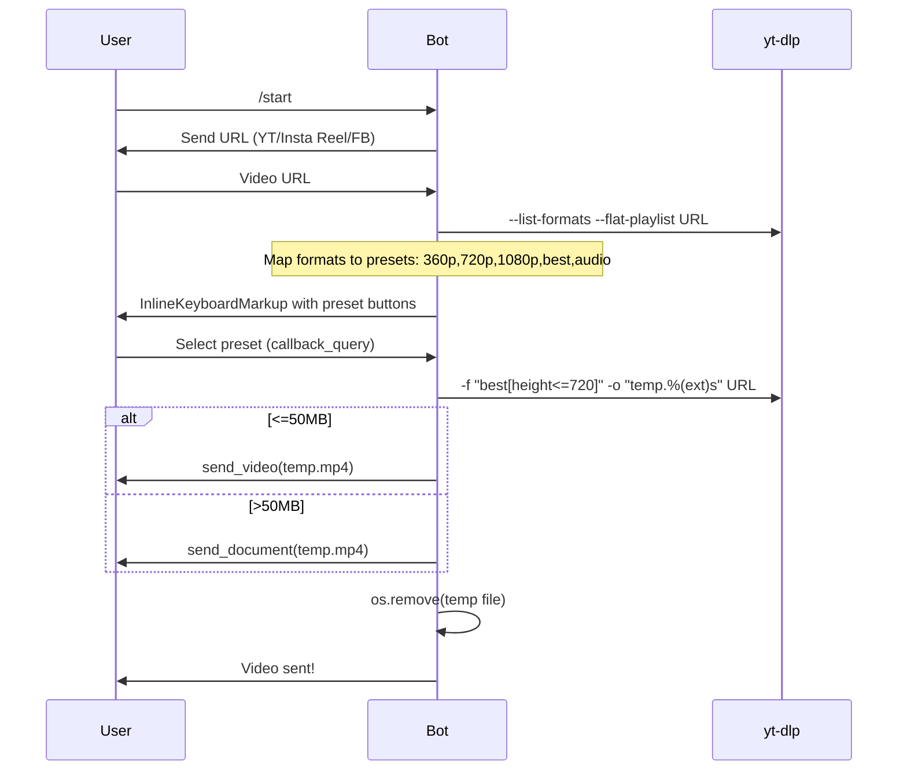

# Telegram Video Downloader Bot - Architecture Plan

## Overview
A Telegram bot that downloads public videos from YouTube, Instagram Reels, and Facebook in user-selected quality presets. Uses Python, aiogram for bot handling, yt-dlp for downloads. Handles Telegram 50MB limit by sending large files as documents.

## Tech Stack
- Python 3.10+
- [aiogram](https://github.com/aiogram/aiogram) (async Telegram Bot API framework)
- [yt-dlp](https://github.com/yt-dlp/yt-dlp) (universal video downloader)
- Temporary file storage for downloads (cleanup after send)

## Bot Workflow


## Quality Presets (yt-dlp format selectors)
| Preset | yt-dlp Selector | Description |
|--------|-----------------|-------------|
| 360p   | best[height<=360] | Up to 360p video |
| 720p   | best[height<=720] | Up to 720p video |
| 1080p  | best[height<=1080] | Up to 1080p video |
| Best   | best | Highest quality video |
| Audio  | bestaudio | Best audio only (m4a/opus) |

## Project Structure
```
.
├── requirements.txt     # pip install -r requirements.txt
├── config.py            # BOT_TOKEN = "paste_your_token_here"
├── bot.py               # Main bot entrypoint and handlers
├── downloader.py        # Wrapper for yt-dlp operations
├── plan.md              # This architecture doc
├── README.md            # User guide + deploy instructions
└── .env.example         # Template for env vars
```

## Key Implementation Notes
- **States**: Use FSMContext for multi-step: URL -> select quality
- **Callbacks**: Inline buttons for quality selection (data="360p")
- **File handling**: Download to ./downloads/ temp dir, check size with os.path.getsize
- **Errors**: Invalid URL, private video, network issues -> user-friendly messages
- **Limits**: yt-dlp rate limits, Telegram flood waits
- **Security**: Sanitize URLs, no user input in commands
- **Legal**: Public videos only. Remind users to respect platform ToS.

## Deployment Options
1. **Local dev**: `python bot.py`
2. **Railway/Heroku**: Git push, requirements.txt auto-install
3. **VPS**: `screen -S bot`, systemd service, nginx? No, polling/webhook.

## Next Steps
Review plan.md, approve, switch to code mode.